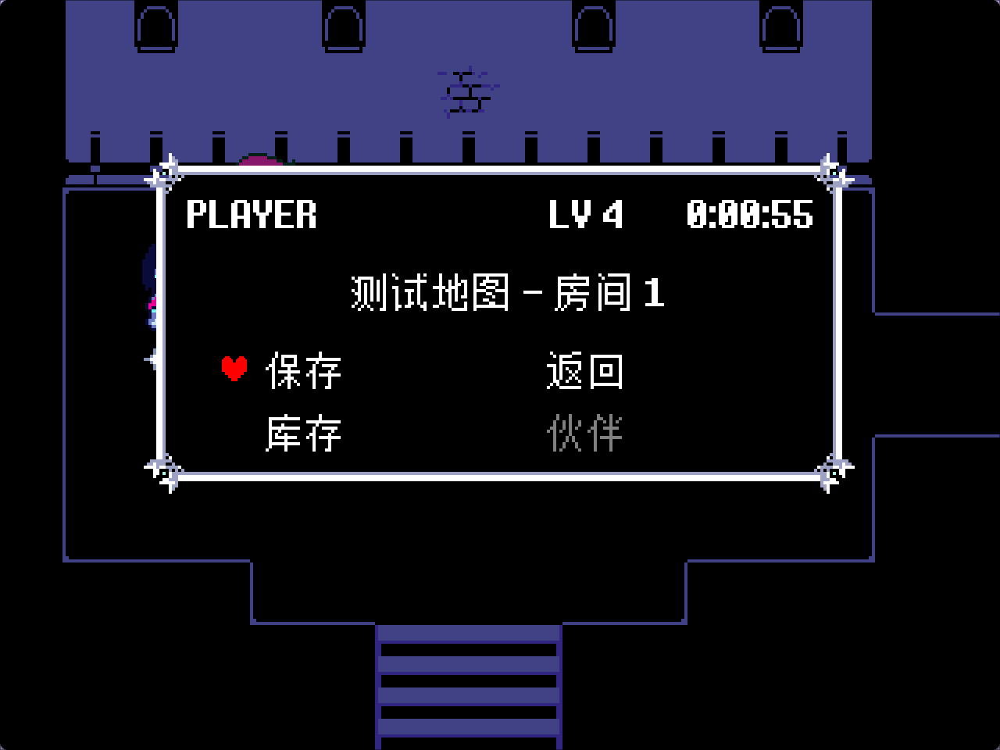

# langlib_chinese_test

[](LICENSE-APACHE)
<br>


> 当前状态：✅ 测试用模组



**langlib_chinese_test** — [langLib_zh_hans](https://github.com/Bli-AIk/kristal-langlib-zh-hans) 的集成测试与演示模组，用于验证和展示 Kristal 模组的中文汉化能力。

| 简体中文 | English                   |
| -------- | ------------------------- |
| 简体中文 | [English](./README_en.md) |

## 简介

`langlib_chinese_test` 是一个 Kristal 测试模组，完整演示了 `langLib_zh_hans` 库的各项汉化能力。它覆盖了文本、菜单、物品、技能、角色名、Tiled 地图/NPC/Interactable 等常见入口的本地化，并内置 F7 实时语言切换。

本模组同时也是汉化库开发过程中的集成验证工具——每个汉化入口在此都有对应的测试用例，确保库更新不破坏已有功能。

## 特性

- 🌐 中英双语，F7 一键切换
- 📝 Cutscene 文本按 `id` 本地化
- 🎛️ Cutscene 选项按 `ids` 本地化
- 🗺️ Tiled NPC / Interactable 通过 `id1`/`id2` 属性本地化
- 🏷️ Tiled 地图名通过 `name_id` 属性本地化
- ⚔️ 物品、武器、防具、法术自动 key 化
- 🔤 中文字体 fallback：英文用原版字体，中文回落至 FZBitmap/Unifont

## 依赖

| 库                                                                    | 说明                           |
| --------------------------------------------------------------------- | ------------------------------ |
| [Kristal](https://github.com/KristalTeam/Kristal)                     | 游戏引擎，`v0.10.0` 或更高版本 |
| [langLib_zh_hans](https://github.com/Bli-AIk/kristal-langlib-zh-hans) | 中文本地化库                   |

## 使用方式

1. 安装 [Kristal](https://github.com/KristalTeam/Kristal) 引擎。
2. 将本仓库克隆到 Kristal 的 `mods/` 目录下，并初始化 submodule：

   ```bash
   cd Kristal/mods
   git clone https://github.com/Bli-AIk/langlib_chinese_test.git
   cd langlib_chinese_test
   git submodule update --init
   ```

3. 启动 Kristal，在模组选择中选择 **langlib_chinese_test**。
4. 按 F7 可随时切换中英文。

## 参考来源

本项目本地化方案参考了以下汉化项目：

| 项目                                                          | 作者/组织                                              |
| ------------------------------------------------------------- | ------------------------------------------------------ |
| 若干其他 Kristal 项目的汉化参考                               | [WasneetPotato](https://space.bilibili.com/1641628190) |
| [DeltaruneChinese](https://github.com/gm3dr/DeltaruneChinese) | dr好人汉化组                                           |

## 参与贡献

欢迎提交 Issue 或 Pull Request。

## 许可证

本项目采用双许可证授权，您可以选择以下任一许可证：

- Apache License, Version 2.0 ([LICENSE-APACHE](LICENSE-APACHE) 或 http://www.apache.org/licenses/LICENSE-2.0)
- MIT license ([LICENSE-MIT](LICENSE-MIT) 或 http://opensource.org/licenses/MIT)
